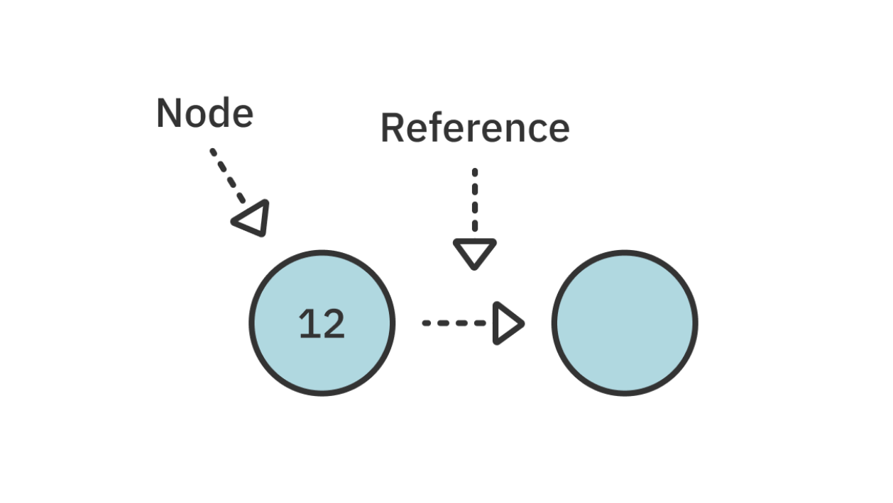
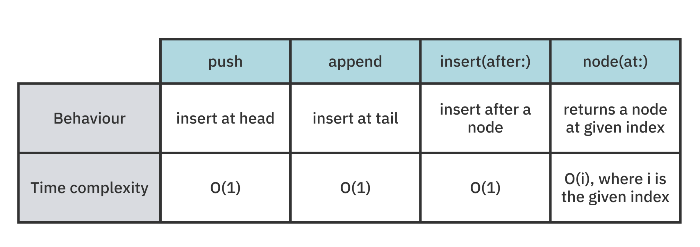

## 💡 Linked Lists
> Linked Lists에 대해 알아보자 ! </br>

* 특징 </br>
` Linked Lists는 선형적이며 단방향적인 순서로 정렬된 값의 모음입니다.`

* 장점 </br>
` 앞부분에 대한 삽입 및 삭제가 이루어질 경우 Array에 비해 빠른 시간 복잡도를 가진다는 장점이 있습니다. `




</br>

위의 다이어그램에서 알 수 있듯, 각각의 Node는 다음과 같은 특징을 가집니다. 

</br>

1. 모든 노드들의 `값(value)`을 가지고 있습니다.
2. 다음 노드를 `참조(reference)`합니다. nil 값을 가질 경우, 즉 참조할 다음 노드가 없을 경우 List의 끝을 의미합니다.

</br>
</br>

## 👀 Adding values to the list
> list에 값을 추가해보자 ! </br>

list에 값을 추가하는 방법은 다음 3가지 입니다. </br>

1. push : list의 맨 앞에 값을 추가
2. append : list의 맨 끝에 값을 추가
3. insert(after: ) : 특정 노드 뒤에 값을 추가

### Push
` head-first 삽입 ` </br>

```swift
var list = LinkedList<Int>()
list.push(3)
list.push(2)
list.push(1)

print(list)
```
> 1 2 3 </br>
> head-first 삽입이므로 다음과 같은 결과가 나옵니다. </br>

</br>

### Append
` tail-end 삽입 ` </br>

```swift
var list = LinkedList<Int>()
list.append(1)
list.append(2)
list.append(3)

print(list)
```
> 1 2 3 </br>
> 입력 순서가 바뀌었음에도 불구하고, append의 경우 list의 끝부터 삽입이 이루어지므로 동일한 결과가 나옵니다. </br>

### Insert(after:)
` 특정 위치에 값을 추가합니다. ` </br>

다음 두가지의 단계가 필요합니다. </br>

1. List에서 특정 노드 찾기 
2. 새로운 노드 삽입하기

</br>

```swift
public func node(at index: Int) -> Node<Value>? {
  
  var currentNode = head
  var currentIndex = 0

  
  while currentNode != nil && currentIndex < index {
    currentNode = currentNode!.next
    currentIndex += 1
  }

  return currentNode
}
```
> while 루프를 사용해 원하는 인덱스에 도달 할 때까지 이동해 찾고자하는 값의 인덱스를 찾습니다. </br>

* 각 operation들의 시간 복잡도는 다음과 같습니다. 



</br>
</br>

## 👀 Removing values from the list
> list에서 값을 지워보자 ! </br>

list에서 값을 삭제하는 방법은 다음 3가지 입니다. </br>

1. pop : list의 맨 앞에서 값을 제거
2. removeLast : list의 맨 끝에서 값을 제거
3. remove(at:) : list의 어디서든 값을 제거

### Pop

* pop 연산은 반환값으로 list에서 제거된 값을 리턴
* 따라서 list가 비어있을 수도 있으므로, 이 값은 **옵셔널** 타입을 가집니다.

```swift
var list = LinkedList<Int>()

list.push(3)
list.push(2)
list.push(1)

let poppedValue = list.pop()
 
print(String(describing: poppedValue))
```
> Optional(1)

</br>

### removeLast

* head가 nil일 경우 제거할 것이 없으므로 nil을 반환
* list에 노드가 하나만 있는 경우 removeLast는 pop과 기능적으로 동일
* pop에서와 마찬가지로 리턴 값은 **옵셔널**타입을 가집니다.

### remove(after: )
> remove(after )을 사용하기위해선 삭제하려는 노드 바로 전의 노드를 찾은 후 다음 노드를 unlink 해야합니다. </br>

```swift
var list = LinkedList<Int>()

list.push(3)
list.push(2)
list.push(1)

let index = 1
let node = list.node(at: index - 1)!
let removedValue = list.remove(after: node)

```
> 다음의 코드를 살펴보면 node에 list의 첫번 째 값이 할당되므로 </br>
> list.remove(after: node) 입력 시 두번째 값이 삭제됩니다. 

</br> 

## ⭐️ Key Points 
> 키포인트 ! </br> 

- Linked Lists는 **선형적**이며 **단방향적**입니다. 따라서 노드 간 참조를 이동하면 다시 돌아갈 수 없습니다.
- Array의 경우 O(n)의 시간 복잡도를 가지는 반면, Linked Lists의 경우 O(1)의 시간 복잡도를 가집니다.
- Swift collection protocols을 준수하면 유용한 매서드에 쉽게 접근할 수 있습니다.

</br>

` 🩶 출처 : Data Structures & Algorithms in Swift By Matthijs Hollemans (https://itunes.apple.com/WebObjects/MZStore.woa/wa/viewBook?id=0) `

</br>
