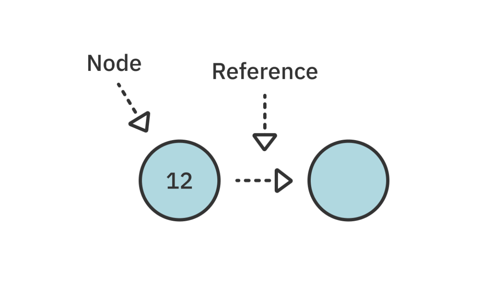
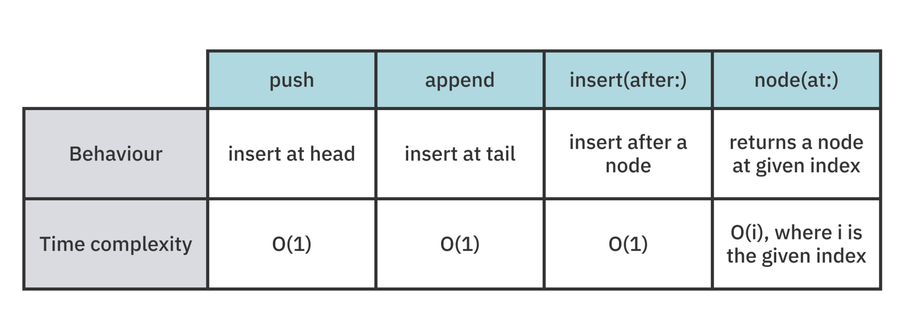

## 💡 Linked Lists
> Linked Lists에 대해 알아보자 ! </br>

* 특징 </br>
Linked Lists는 ` 각각의 노드가 데이터와 다음 노드에 대한 참조를 가지고 있는 선형 데이터 구조`입니다.

</br>

* 장점 </br>
Linked Lists는 다음 노드의 위치를 가지고 있기 때문에 연속적으로 저장할 필요가 없습니다. </br>
따라서 중간 삽입, 삭제를 해도 연산의 오버헤드가 발생하지 않아 O(1)의 `빠른 시간복잡도`를 가집니다. </br>

</br>



</br>

위의 다이어그램에서 알 수 있듯, 각각의 Node는 다음과 같은 특징을 가집니다. 

</br>

* 기본적으로 연결 리스트는 `노드`로 구성 </br>
* 모든 노드들은 `값(value)`을 가지고 있습니다.
* 다음 노드를 `참조(reference)`합니다. nil 값을 가질 경우, 즉 참조할 다음 노드가 없을 경우 List의 끝을 의미
* 각 노드는 `데이터 필드`와 `포인터 필드`로 구성</br> 
* 데이터 필드는 노드가 저장하는 `실제 데이터`를 나타내며, 포인터 필드는 `다음 노드에 대한 참조를 저장`</br>
* 마지막 노드의 포인터 필드는 `NULL`로 설정

</br>
</br>

## 💡 Array와 Linked Lists의 차이점
> Linked Lists 왜 쓰나요? </br>

Array와 Linked Lists 모두 여러 개의 값을 list형태로 저장할 수 있는 데이터 구조입니다. </br>

### cf) Array

* 인덱스를 기반으로 한 순차적 데이터 구조
* 빠른 검색이 필요한 경우나 데이터를 빠르게 순회해야 할 때 유용
* Array의 모든 요소는 메모리의 연속된 위치에 저장되므로 캐시 효율성이 높고 메모리에 대한 직접적인 액세스가 가능
* 요소의 추가나 제거가 가능

따라서 `데이터의 검색이 빈번하게 일어나는 경우`에는 Array가 더 적합하며, </br> 
데이터의 `삽입이나 삭제가 빈번하게 일어나는 경우`에는 LinkedList가 더 적합합니다. </br>

</br>
</br>

## 💡 Swift에서의 구현 

### Node 클래스

```swift
class Node<T> {
    var value: T
    var next: Node<T>?

    init(_ value: T) {
        self.value = value
    }
}
```


### Linked Lists

```swift

public struct LinkedList<Value> {
  
  public var head: Node<Value>?
  public var tail: Node<Value>?

  public init() {}

  public var isEmpty: Bool {
    head == nil
  }
}
```

</br>
</br>

## 💡 Adding values to the list
> list에 값을 추가해보자 ! </br>

list에 값을 추가하는 방법은 다음 3가지 입니다. </br>

1. push : list의 맨 앞에 값을 추가
2. append : list의 맨 끝에 값을 추가
3. insert(after: ) : 특정 노드 뒤에 값을 추가

### 1. Push
` head-first 삽입 ` </br>

```swift
var list = LinkedList<Int>()
list.push(3)
list.push(2)
list.push(1)

print(list)
```
> 1 2 3 </br>
> head-first 삽입이므로 다음과 같은 결과가 나옵니다. </br>

</br>

### 2. Append
` tail-end 삽입 ` </br>

```swift
var list = LinkedList<Int>()
list.append(1)
list.append(2)
list.append(3)

print(list)
```
> 1 2 3 </br>
> 입력 순서가 바뀌었음에도 불구하고, append의 경우 list의 끝부터 삽입이 이루어지므로 동일한 결과가 나옵니다. </br>

### 3. Insert(after:)
` 특정 위치에 값을 추가합니다. ` </br>

다음 두가지의 단계가 필요합니다. </br>

1. List에서 특정 노드 찾기 
2. 새로운 노드 삽입하기

</br>

```swift
public func node(at index: Int) -> Node<Value>? {
  
  var currentNode = head
  var currentIndex = 0

  
  while currentNode != nil && currentIndex < index {
    currentNode = currentNode!.next
    currentIndex += 1
  }

  return currentNode
}
```
> while 루프를 사용해 원하는 인덱스에 도달 할 때까지 이동해 찾고자하는 값의 인덱스를 찾습니다. </br>

* 각 operation들의 시간 복잡도는 다음과 같습니다. 



</br>
</br>

## 💡 Removing values from the list
> list에서 값을 지워보자 ! </br>

list에서 값을 삭제하는 방법은 다음 3가지 입니다. </br>

1. pop : list의 맨 앞에서 값을 제거
2. removeLast : list의 맨 끝에서 값을 제거
3. remove(at:) : list의 어디서든 값을 제거

### 1. Pop

* pop 연산은 반환값으로 list에서 제거된 값을 리턴
* 따라서 list가 비어있을 수도 있으므로, 이 값은 **옵셔널** 타입을 가집니다.

```swift
var list = LinkedList<Int>()

list.push(3)
list.push(2)
list.push(1)

let poppedValue = list.pop()
 
print(String(describing: poppedValue))
```
> Optional(1)

</br>

### 2. removeLast

* head가 nil일 경우 제거할 것이 없으므로 nil을 반환
* list에 노드가 하나만 있는 경우 removeLast는 pop과 기능적으로 동일
* pop에서와 마찬가지로 리턴 값은 **옵셔널**타입을 가집니다.

### 3. remove(after: )
> remove(after )을 사용하기위해선 삭제하려는 노드 바로 전의 노드를 찾은 후 다음 노드를 unlink 해야합니다. </br>

```swift
var list = LinkedList<Int>()

list.push(3)
list.push(2)
list.push(1)

let index = 1
let node = list.node(at: index - 1)!
let removedValue = list.remove(after: node)

```
> 다음의 코드를 살펴보면 node에 list의 첫번 째 값이 할당되므로 </br>
> list.remove(after: node) 입력 시 두번째 값이 삭제됩니다. 

</br> 

## ⭐️ Key Points 
> 키포인트 ! </br> 

- Linked Lists는 **선형적**이며 **단방향적**입니다. 따라서 노드 간 참조를 이동하면 다시 돌아갈 수 없습니다.
- Array의 경우 O(n)의 시간 복잡도를 가지는 반면, Linked Lists의 경우 O(1)의 시간 복잡도를 가집니다.
- Swift collection protocols을 준수하면 유용한 매서드에 쉽게 접근할 수 있습니다.

</br>

` 🩶 출처 : Data Structures & Algorithms in Swift By Matthijs Hollemans` 
(https://itunes.apple.com/WebObjects/MZStore.woa/wa/viewBook?id=0) 

</br>
