# Queues

큐는 대기열에서 무언가를 기다리는 것과 마찬가지로, `FIFO(First-In First-Out)` 즉, 먼저 추가된 요소가 항상 먼저 제거되는 순서를 가집니다. </br>
따라서 큐는 `요소의 순서를 유지`해야할 때 유용합니다. </br>

## 💡 Common Operations
> 큐의 핵심 동작을 알아보자 ! </br>

```swift
public protocol Queue {
    associatedtype Element
    mutating func enqueue(_ element: Element) -> Bool
    mutating func dequeue() -> Element?
    var isEmpty: Bool { get }
    var peek: Element? { get }
}
```

</br>

위의 프로토콜은 큐의 핵심 동작을 설명합니다. </br>

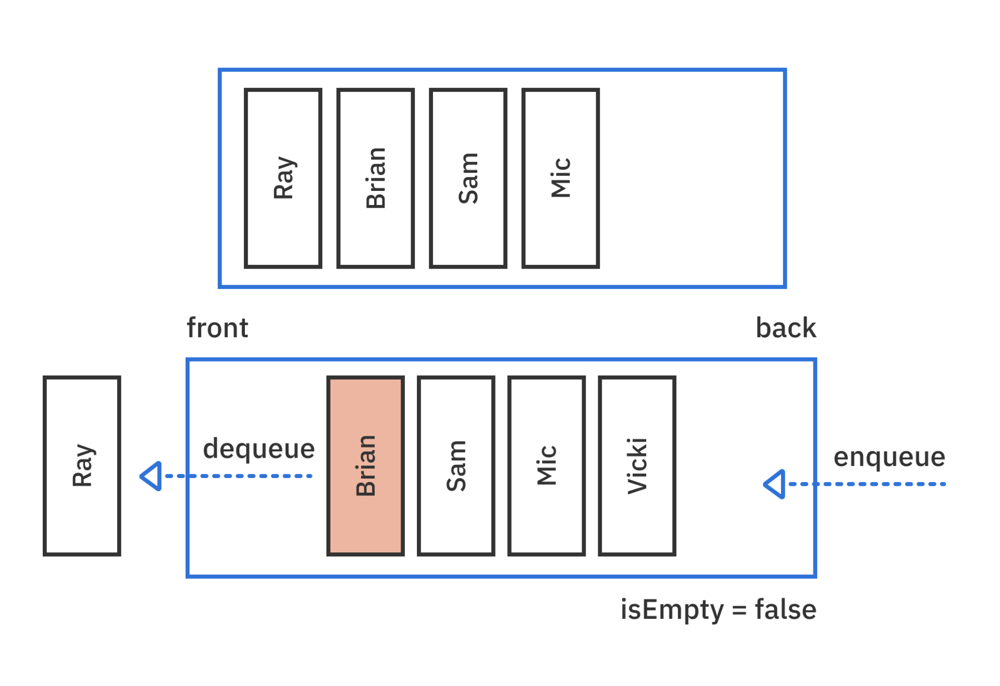
</br>

1. **enqueue** : 큐의 뒷부분에 요소를 삽입합니다. 수행되면 true를 반환합니다. 
2. **dequeue** : 큐의 맨 앞에서 요소를 제거하고 반환합니다.
3. **isEmpty** : 큐가 비어 있는지 확인합니다.
4. **peek** : 큐의 맨 앞의 요소를 제거하지 않고 반환합니다.

큐의 경우 오진 맨 앞에서의 삭제와 뒷부분에서의 삽입만을 고려합니다. </br>
중간에 어떤 요소가 있는지 알고 싶을 경우에는 배열을 사용하는 것이 좋습니다. </br>

</br>

## 💡 Implementation
> 큐를 구현하는 다양한 방법들에 대해 알아보자 ! </br>

### 1. Array-based implementatin
> 배열 기반으로 큐 구현하기 ! </br>

```swift
public struct QueueArray<T>: Queue {
    private var array: [T] = []
    public init() {}
}
```
</br>

QueueArray는 Queue 프로토콜을 채택하고 있으며, 제네릭 타입 T를 받는 구조체입니다. </br>

```swift
public var isEmpty: Bool {
    array.isEmpty // 1
}

public var peek: T? {
    array.first // 2
}
```
> 배열을 활용해 다음의 것들을 할 수 있습니다 </br>

1. 큐가 비어 있는지 확인하기
2. 큐의 첫 번째 요소 반환하기 

두 개의 작업 모두 `O(1)`의 시간 복잡도를 가집니다. </br>
</br>

#### Enqueue

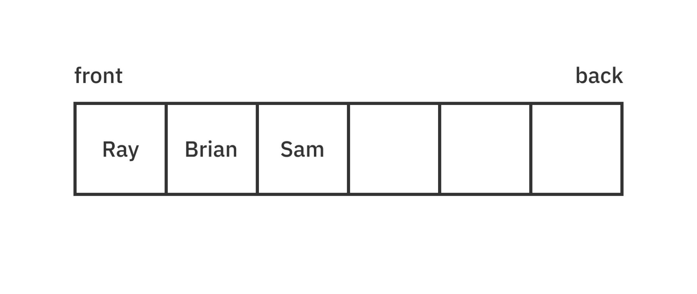

* 배열(Array)은 연속적이고 순서가 있는 요소 목록을 저장하는 데이터 구조있니다.

</br>

```swift
public mutating func enqueue(_ element: T) -> Bool {
    array.append(element)
    return true
}
```
> append를 이용해 큐의 뒤에 요소를 추가합니다. </br>

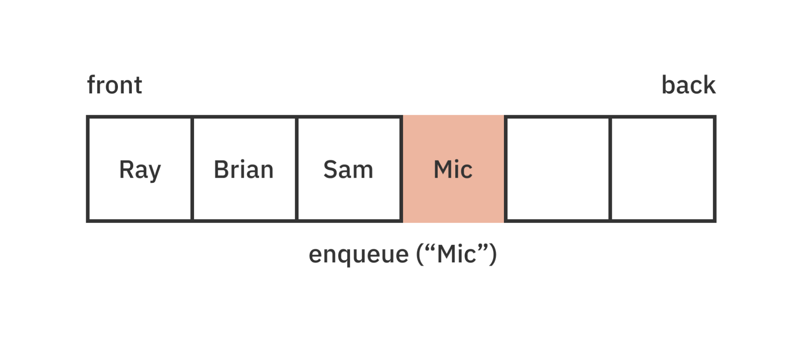

배열의 뒷부분에는 빈 공간이 존재하므로 이러한 작업의 경우 대부분 `O(1)`의 시간 복잡도를 가집니다. </br>

따라서 배열 기반의 큐에서는 `Enqueue`연산이 빠른 속도로 처리됩니다. </br>

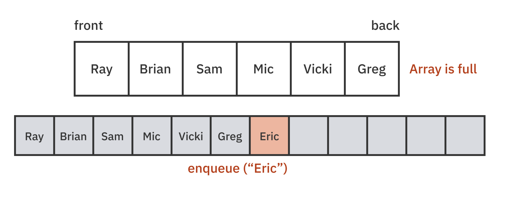

만약 위의 그림처럼 배열이 꽉차있어서 더 이상 요소를 추가할 공간이 없다면, 배열의 크기를 조정해야 합니다. </br>

크기 조정의 경우 새로운 메모리를 할당하고 기존 데이터를 새 배열로 복사해야하기 때문에 `O(n)`의 시간 복잡도를 가집니다. </br>

#### Dequeue

```swift
public mutating func dequeue() -> T? {
    isEmpty ? nil : array.removeFirst()
}
```

위의 코드를 통해 값을 제거할 수도 있습니다. </br>

만약 큐가 비어있으면 `nil을 반환`하고, 그렇지 않은 경우에는 큐의 `맨 앞에 있는 요소`를 제거하고 반환합니다.</br>

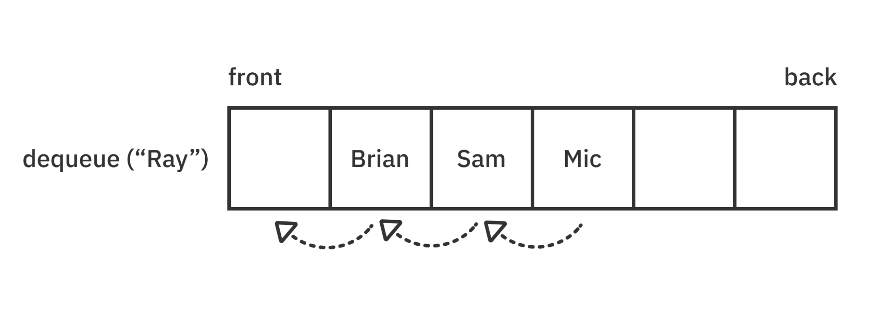

큐가 배열로 구현된 경우, 큐의 첫 번째 요소가 제거될 때 *나머지 요소들은 모두 한 칸씩 앞으로 이동*해야하므로 `O(n)`의 시간복잡도를 가집니다. </br>

#### Debug and test

```swift
extension QueueArray: CustomStringConvertible {
  public var description: String {
    return array.description
  }
}
```

위의 코드는 QueueArray 구조체가 CustomStringConvertible 프로토콜을 채택하도록 하여, 큐의 내용을 문자열 형태로 표시하는 기능을 추가하는 것 입니다. </br>

반환 값은 내부 배열(array)의 description 연산 프로퍼티를 호출한 결과입니다. </br>

#### 📍 정리

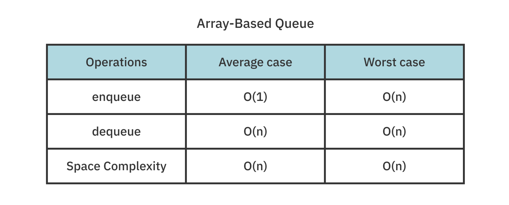

큐 구현의 장점은 Swift 배열의 O(1) append연산으로 인해 Enqueue가 매우 빠르다는 것 입니다. </br>

하지만 첫 번째 항목을 제거하는 dequeue의 경우 모든 요소를 한 칸씩 이동해야 하기 때문에 비효율적입니다. </br>

또한, 배열이 가득 차면 크기를 조정해야하고 사용하지 않는 빈 공간이 생길 수 있습니다. </br>

</br>

### 2. Doubly linked list implementation
> Linked List 기반으로 큐 구현하기 ! </br>

```swift
public class QueueLinkedList<T>: Queue {
    private var list = DoublyLinkedList<T>()
    public init() {}
}
```
</br>

QueueLinkedList라는 제네릭 클래스를 생성하고, Queue 프로토콜을 구현하는 방법입니다. </br>

QueueLinkedList는 DoublyLinkedList라는 클래스를 사용하여 구현되며, QueueArray와 비슷하게 동작합니다. </br>

#### Enqueue

```swift
public func enqueue(_ element: T) -> Bool {
    list.append(element)
    return true
}
```
</br>

`append`를 사용해 값을 추가할 수 있습니다. </br>

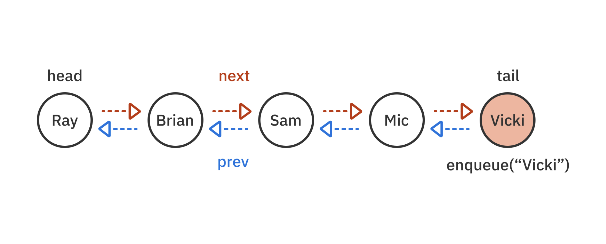

</br>

새로운 노드를 큐의 맨 뒤에 추가할 때, 이전 마지막 노드의 next와 새로운 노드의 previous를 업데이트하는 단계를 포함합니다. </br>

이 때, 시간 복잡도는 O(1)입니다. </br>

#### Dequeue

```swift
public func dequeue() -> T? {
  guard !list.isEmpty, let element = list.first else {
    return nil
  }
  return list.remove(element)
}
```
> list가 비어있지 않고, 첫 번째 요소가 있는지 확인합니다. </br>
> 그렇지 않을 경우, nil을 반환합니다. </br>
> 조건을 충족할 경우, 큐의 맨 앞 요소를 제거하고 반환합니다. </br>

</br>

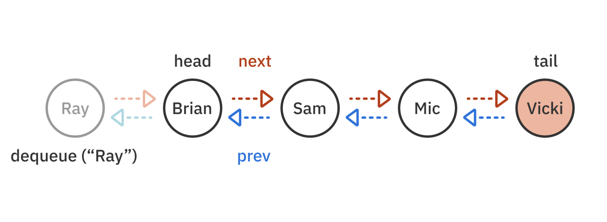

</br>

연결 리스트 기반의 큐에서 Dequeue는 O(1)의 시간 복잡도를 가집니다. </br>

그 이유는, 배열 기반의 큐와 다르게 나머지 요소들을 한 칸씩 이동할 필요가 없기 때문입니다. </br>

대신 연결 리스트에서는 첫 번째 두 노드 사이의 next, prev 포인터를 갱신하면 됩니다. </br>
</br>

#### Checking the state of a queue

```swift
public var peek: T? {
    list.first?.value
}

public var isEmpty: Bool {
    list.isEmpty
}
```
</br>
</br>

#### Debug and test

```swift
extension QueueLinkedList: CustomStringConvertible {
  public var description: String {
    String(describing: list)
  }
}
```
> QueueLinkedList에서 `CustomStringConvertible` 프로토콜을 채택하면서 DoublyLinkedList에서 이미 구현되어있는 `description 속성`을 그대로 사용할 수 있게 됩니다. </br>
> 따라서 QueueLinkedList의 description 속성에 접근하면 내부적으로 DoublyLinkedList의 description 속성이 호출되어 해당 리스트의 내용을 문자열로 반환합니다. </br>

</br>

#### 📍 정리

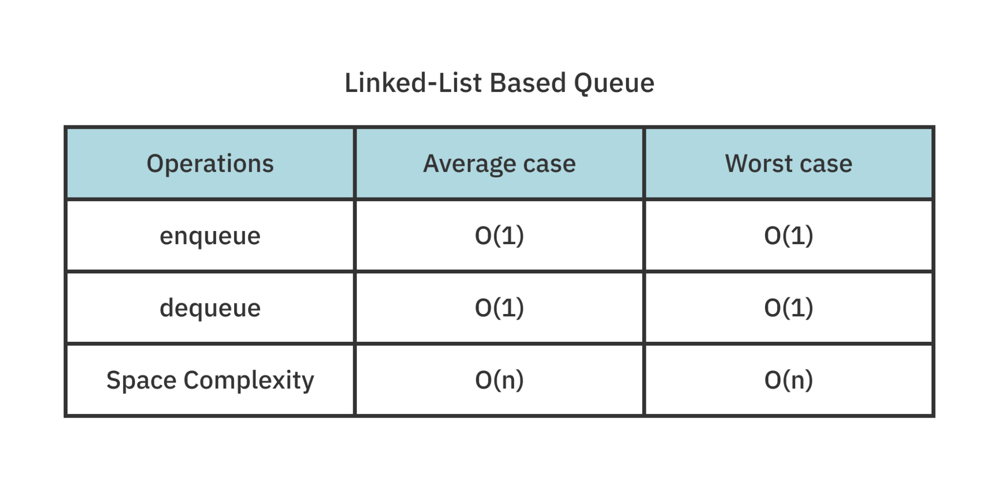

</br>

QueueLinkedList와 달리 QueueArray는 상수 시간(O(1)) 내에 아이템을 제거할 수 없기 때문에 문제가 있습니다. </br>

그러나 연결 리스트 구현에서는 `노드의 이전 및 다음 포인터를 업데이트`하는 것이므로 선형 시간(O(n))이 아닌 상수 시간(O(1))안에 제거할 수 있습니다. </br>

하지만 QueueLinkedList의 단점은 O(1) 시간 복잡도에도 불구하고 `높은 overhead`를 가지고 있다는 것 입니다. </br>

왜냐하면 각 요소는 전진 및 후진 참조를 위한 추가 저장소가 필요합니다. </br>

또한 새 요소를 생성할 때마다 동적 할당(dynamic allocation)이 필요한 것도 overhead를 증가시키는 요인 중 하나입니다. </br>

따라서 **QueueLinkedList**는 많은 요소를 저장하려면 많은 메모리와 시간이 필요하게 됩니다. </br>

이에 비해 **QueueArray**는 `일괄 할당(bulk allocation)`을 사용하여 더 빠르게 메모리를 할당하므로, `큰 규모의 요소를 다루는 경우에 더 효율적`입니다. </br>

그러나 큐가 고정 크기를 초과하지 않을 경우에는 *링 버퍼를 기반*으로 하는 다른 방식을 사용할 수 있습니다. </br>
</br>

### 3. Ring buffer implementation
> Ring buffer로 큐 구현하기 ! </br>

환형 버퍼(Circular buffer)라고 불리는 Ring buffer는 고정 크기 배열입니다. </br>

이 데이터 구조는 끝에서 더 이상 제거할 항목이 없을 때 시작점으로 묶이는 방식으로 작동합니다. </br>

**예시**

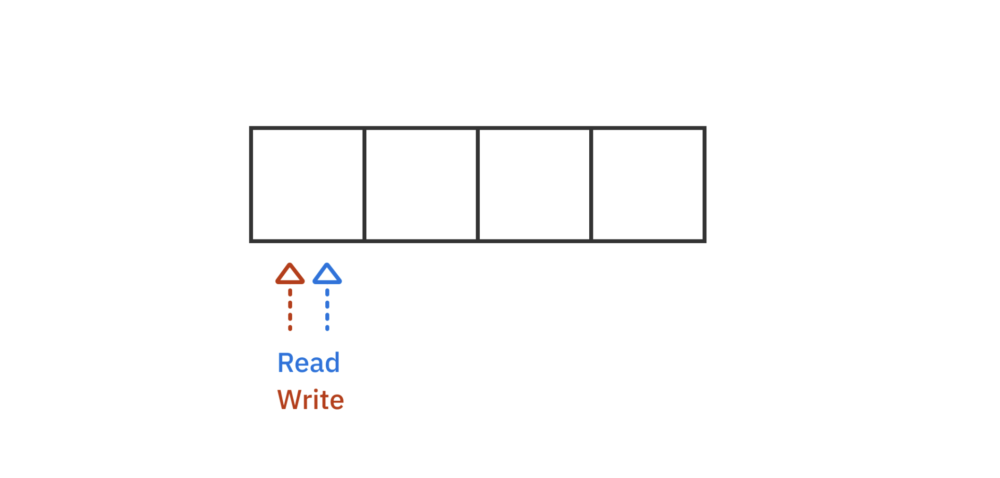
</br>

먼저 크기가 4인 ring buffer를 만듭니다. </br>

ring buffer에는 두개의 포인터가 있습니다. </br>

1. **read** pointer : 큐의 맨 앞을 가리키는 포인터
2. **write** pointer : 이미 읽혀진 요소들을 덮어쓸 수 있도록, 다음에 사용할 요소의 위치를 가리키는 포인터

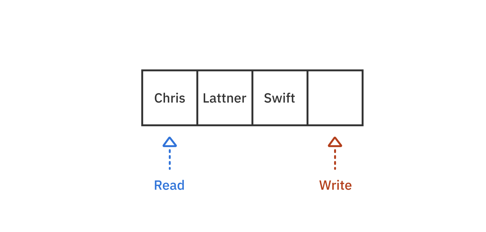
</br>

큐에 요소가 추가될 때 마다, write 포인터는 1칸 씩 증가합니다. </br>

write포인터가 read 포인터보다 앞서있는 경우, 큐가 비어있지 않다는 것을 의미합니다. </br>

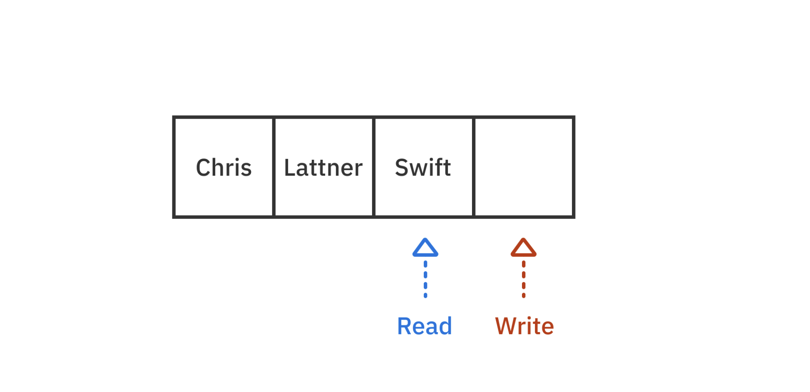

</br>

위의 그림은 앞에 있는 2개의 요소를 제거(dequeue)하는 과정입니다. </br>

read 포인터를 오른쪽으로 2칸 이동해줌으로써 제거됩니다. </br>

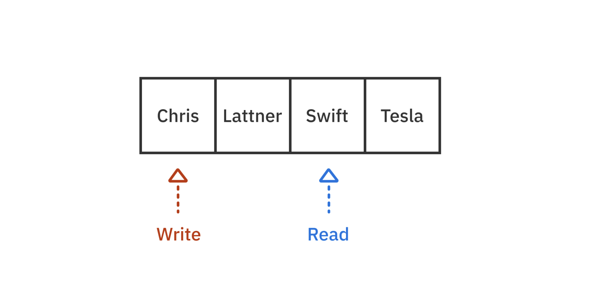

</br>

다음과 같이 요소를 하나 더 추가해, write 포인터가 배열의 끝에 도달하면, `시작 인덱스`로 다시 돌아가게 됩니다. </br>


</br>

두 개의 요소를 제거해 read포인터도 시작 인덱스로 돌아가게 되어 read와 write 포인터의 위치가 같아지게 되면, 큐는 비어있음을 의미합니다. </br>

```swift
public struct QueueRingBuffer<T>: Queue {
    private var ringBuffer: RingBuffer<T>

   public init(count: Int) {
    ringBuffer = RingBuffer<T>(count: count)
}

   public var isEmpty: Bool {
    ringBuffer.isEmpty
}

   public var peek: T? {
    ringBuffer.first
  }
}
```
</br>

ring buffer는 고정된 크기를 가지므로 count 매개변수를 포함해아 합니다. </br>

`isEmpty`, `peek` 프로퍼티를 통해 큐의 첫 번째 인덱스에 접근하고 큐가 비어 있는지를 확인할 수 있습니다. </br>

두 과정 모두 O(1)의 시간복잡도를 가집니다. </br>

</br>

#### Enqueue

```swift
public mutating func enqueue(_ element: T) -> Bool {
    ringBuffer.write(element)
}
```
`write 메소드`를 사용해 write 포인터를 1씩 증가시킴으로써 요소를 추가합니다. </br>

ringbuffer의 크기는 고정되어있으므로 Bool값을 반환해 요소가 추가되었는지에 대한 여부를 알 수 있습니다. </br>

`O(1)`의 시간 복잡도를 가집니다. </br>

</br>

#### Dequeue

```swift
public mutating func dequeue() -> T? {
    ringBuffer.read()
}
```

`read 메소드`를 사용해 큐의 맨 앞 요소를 제거할 수 있습니다. </br>

만약 ring buffer가 비어있다면, nil을 반환하고 그렇지 않을 경우 read 포인터를 한칸 이동해 큐의 맨 앞 요소를 삭제할 수 있습니다. </br>

</br>

#### Debug and test

```swift
extension QueueRingBuffer: CustomStringConvertible {
    public var description: String {
        String(describing: ringBuffer)
    }
}
```
QueueRingBuffer의 `description 속성`을 사용하면 해당 QueueRingBuffer 내부에 있는 RingBuffer의 description 속성이 반환됩니다. </br>

</br>

#### 📍 정리

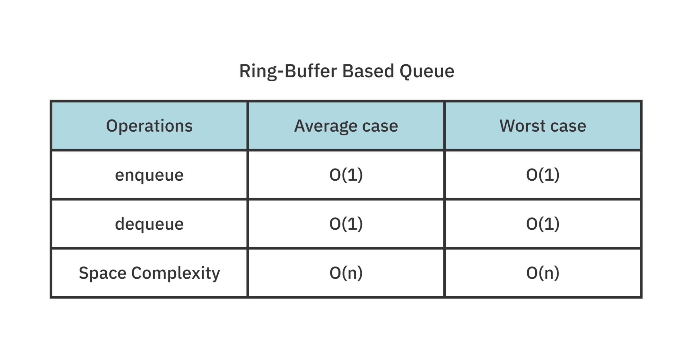 </br>

ring-buffer로 구현된 큐는 값을 추가하고 제거할 때 linked list로 구현된 큐에서와 같은 시간 복잡도 (O(1))가 걸립니다. </br>

하지만, ring-buffer는 고정된 크기를 가지므로 요소를 추가할 때 실패할 수도 있습니다. </br>

</br>

### 4. Double-stack implementation
> 두 개의 스택으로 큐 구현 하기 ! </br>

```swift
public struct QueueStack<T> : Queue {
    private var leftStack: [T] = []
    private var rightStack: [T] = []
    public init() {}
}
```
</br>

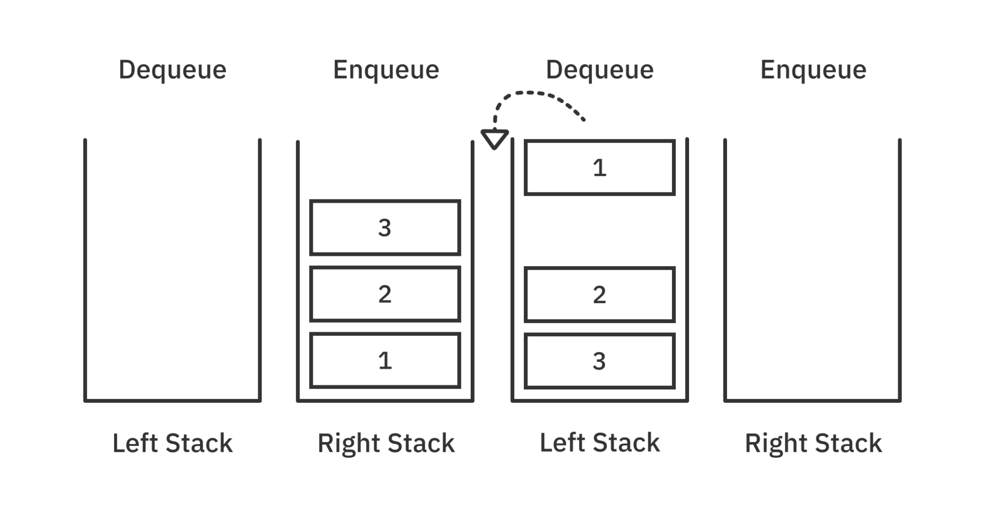 </br>

위 구조체는 Queue 프로토콜을 따르고 있으며, `leftStack`과 `rightStack` 두 개의 스택 배열 프로퍼티를 가지고 있습니다. </br>

`enqueue 연산` 시에는 `rightStack`에 요소를 추가하며, `dequeue 연산` 시에는 **rightStack의 모든 요소를 leftStack으로 이동시킨 뒤**, `leftStack`에서 `FIFO 방식`으로 요소를 추출합니다. </br>

```swift
public var isEmpty: Bool {
    leftStack.isEmpty && rightStack.isEmpty
}
```

</br>

큐가 비어있는지 확인하기 위해선, leftStack과 rightStack 모두 확인해야합니다. </br>

만약 두개의 스택이 모두 비어있는 경우, dequeue할 요소가 없으며 enqueue된 요소도 없다는 것을 의미합니다. </br>

```swift
public var peek: T? {
    !leftStack.isEmpty ? leftStack.last : rightStack.first
}
```
</br>

위 코드는 QueueStack 타입의 인스턴스에서 가장 먼저 dequeue될 요소를 반환하는 `peek 변수`를 구현한 것입니다. </br>

leftStack이 비어 있지 않다면, leftStack의 마지막 요소(1)를 반환합니다. </br>

만약 비어있다면, rightStack을 뒤집어서 leftStack에 추가한 뒤, leftStack의 마지막 요소(1)를 반환합니다. </br>
</br>

#### Enqueue

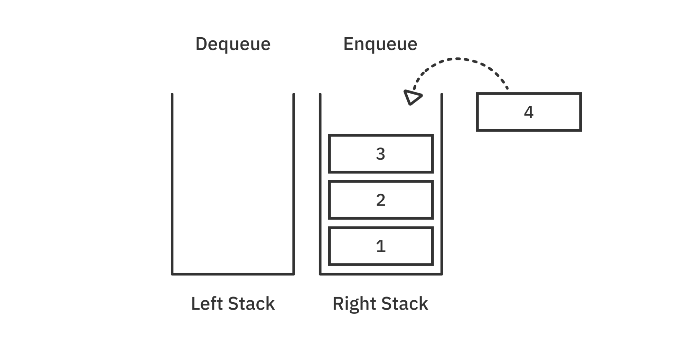 </br>

```swift
public mutating func enqueue(_ element: T) -> Bool {
    rightStack.append(element)
    return true
}
```
</br>

`append`를 통해 값을 rightStack에 추가할 수 있습니다. </br>
</br>

#### Dequeue

```swift
public mutating func dequeue() -> T? {
    if leftStack.isEmpty { // 1
    leftStack = rightStack.reversed() // 2
    rightStack.removeAll() // 3
    }
    return leftStack.popLast() // 4
}
```
</br>

1. leftStack이 비어있는지 확인합니다. 
2. 만약 leftStack이 비어있다면, rightStack을 뒤집어 leftStack을 정의합니다. 
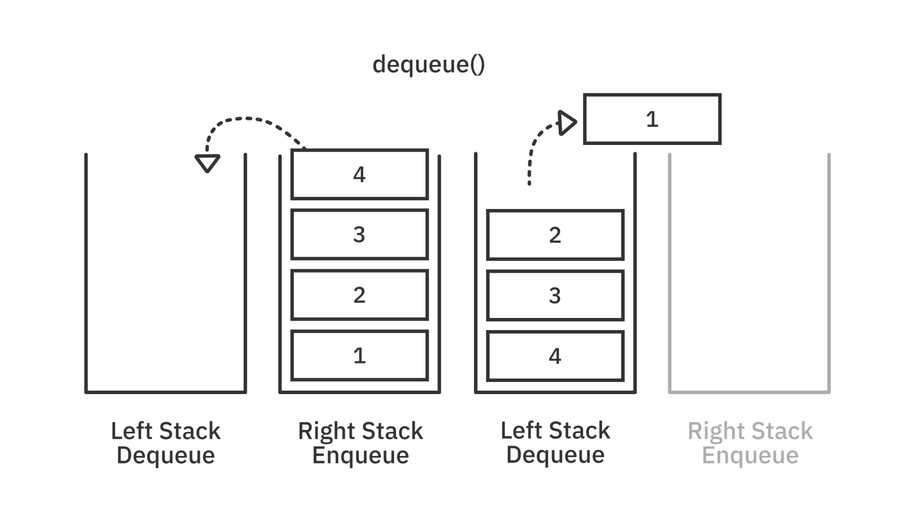 </br>

3. rightStack에 있는 모든 값들을 leftStack으로 옮겼기 떄문에, rightStack의 값을 모두 제거합니다.
4. leftStack()의 첫 번째 값을 반환합니다.

**❗️ 주의 ❗️** </br>
`rightStack의 모든 요소를 leftStack으로 옯기는 것이 아니라, leftStack이 비어있는 경우에만 옮겨줍니다.` </br>

</br>

#### Debug and test

```swift
extension QueueStack: CustomStringConvertible {
    public var description: String {
        String(describing: leftStack.reversed() + rightStack)
    }
}
```
</br>

leftStack과 rightStack을 뒤집어서 합쳐주고 모든 요소를 출력하므로써, Queue에 값들이 잘 들어갔는지 확인할 수 있습니다.</br>
</br>

#### 📍 정리

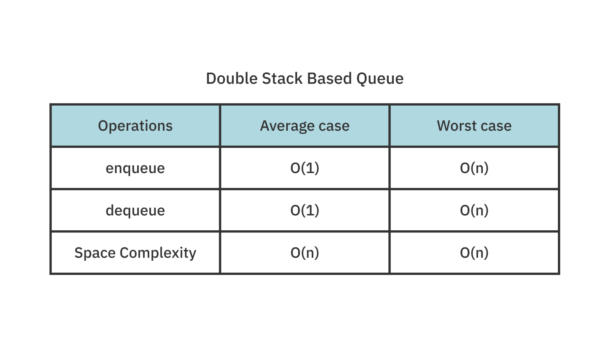 </br>

배열 기반의 큐와 비교했을 떄, 두 개의 스택을 활용하여 큐를 구현하게 되면 dequeue의 작업을 `O(1)`의 시간복잡도로 할 수 있습니다.  </br>

dequeue 작업에서 불필요한 요소 이동을 피할 수 있고, 효율성이 높아집니다. </br>

공간복잡도 측면에서도, 고정 크기의 제한이 없고, 완전히 동적이며 2배씩 늘릴 수도 있으므로 유연합니다. </br>

배열 요소는 메모리 블록 내에서 서로 인접하기 때문에 많은 수의 요소가 처음 액세스할 때 캐시에 로드됩니다. </br>

배열은 O(n)이 필요하지만 간단한 복사 작업에 대해서는 매우 빠르고, 메모리 대역폭 근처에서 발생하는 빠른 O(n)의 값을 가집니다. </br>


## 💡 Key Points 
> 중요 중요 중요 </br>