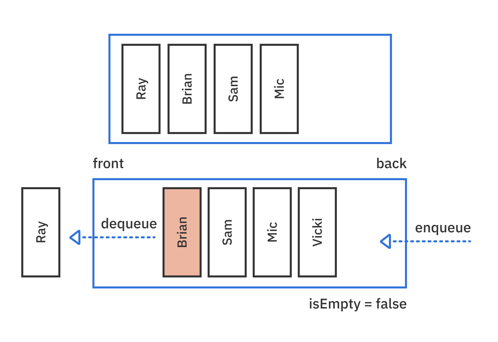
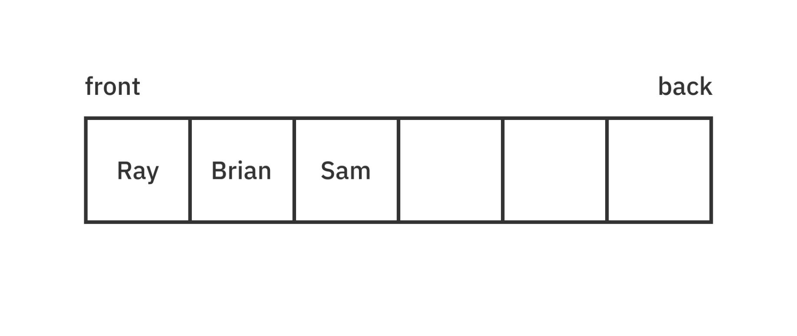
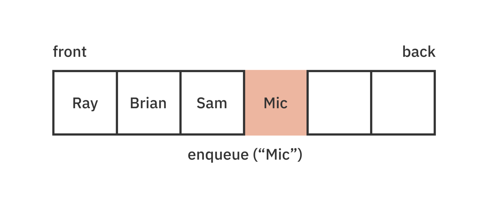
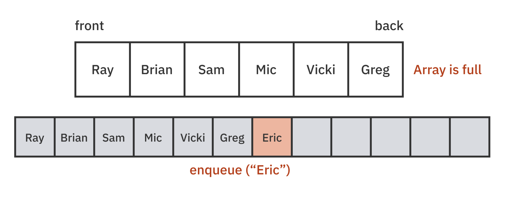
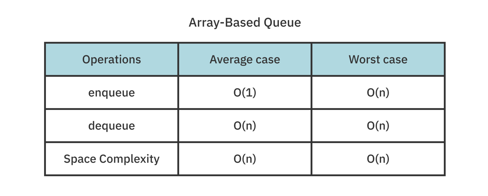

# Queues

큐는 대기열에서 무언가를 기다리는 것과 마찬가지로, `FIFO(First-In First-Out)` 즉, 먼저 추가된 요소가 항상 먼저 제거되는 순서를 가집니다. </br>
따라서 큐는 `요소의 순서를 유지`해야할 때 유용합니다. </br>

## 💡 Common Operations
> 큐의 핵심 동작을 알아보자 ! </br>

```swift
public protocol Queue {
    associatedtype Element
    mutating func enqueue(_ element: Element) -> Bool
    mutating func dequeue() -> Element?
    var isEmpty: Bool { get }
    var peek: Element? { get }
}
```

</br>

위의 프로토콜은 큐의 핵심 동작을 설명합니다. </br>


</br>

1. **enqueue** : 큐의 뒷부분에 요소를 삽입합니다. 수행되면 true를 반환합니다. 
2. **dequeue** : 큐의 맨 앞에서 요소를 제거하고 반환합니다.
3. **isEmpty** : 큐가 비어 있는지 확인합니다.
4. **peek** : 큐의 맨 앞의 요소를 제거하지 않고 반환합니다.

큐의 경우 오진 맨 앞에서의 삭제와 뒷부분에서의 삽입만을 고려합니다. </br>
중간에 어떤 요소가 있는지 알고 싶을 경우에는 배열을 사용하는 것이 좋습니다. </br>

</br>

## 💡 Implementation
> 큐를 구현하는 다양한 방법들에 대해 알아보자 ! </br>

### 1. Array-based implementatin
> 배열 기반으로 큐 구현하기 ! </br>

#### Enqueue



* 배열(Array)은 연속적이고 순서가 있는 요소 목록을 저장하는 데이터 구조있니다.

</br>

```swift
public struct QueueArray<T>: Queue {
    private var array: [T] = []
    public init() {}
}
```
</br>

QueueArray는 Queue 프로토콜을 채택하고 있으며, 제네릭 타입 T를 받는 구조체입니다. </br>

```swift
public var isEmpty: Bool {
    array.isEmpty // 1
}

public var peek: T? {
    array.first // 2
}
```
> 배열을 활용해 다음의 것들을 할 수 있습니다 </br>

1. 큐가 비어 있는지 확인하기
2. 큐의 첫 번째 요소 반환하기 

두 개의 작업 모두 `O(1)`의 시간 복잡도를 가집니다. </br>

```swift
public mutating func enqueue(_ element: T) -> Bool {
    array.append(element)
    return true
}
```
> append를 이용해 큐의 뒤에 요소를 추가합니다. </br>



배열의 뒷부분에는 빈 공간이 존재하므로 이러한 작업의 경우 대부분 `O(1)`의 시간 복잡도를 가집니다. </br>

따라서 배열 기반의 큐에서는 `Enqueue`연산이 빠른 속도로 처리됩니다. </br>



만약 위의 그림처럼 배열이 꽉차있어서 더 이상 요소를 추가할 공간이 없다면, 배열의 크기를 조정해야 합니다. </br>

크기 조정의 경우 새로운 메모리를 할당하고 기존 데이터를 새 배열로 복사해야하기 때문에 `O(n)`의 시간 복잡도를 가집니다. </br>

#### Dequeue

```swift
public mutating func dequeue() -> T? {
    isEmpty ? nil : array.removeFirst()
}
```

위의 코드를 통해 값을 제거할 수도 있습니다. </br>

만약 큐가 비어있으면 `nil을 반환`하고, 그렇지 않은 경우에는 큐의 `맨 앞에 있는 요소`를 제거하고 반환합니다.</br>

큐가 배열로 구현된 경우, 큐의 첫 번째 요소가 제거될 때 *나머지 요소들은 모두 한 칸씩 앞으로 이동*해야하므로 `O(n)`의 시간복잡도를 가집니다. </br>

#### Debug and test

```swift
extension QueueArray: CustomStringConvertible {
  public var description: String {
    return array.description
  }
}
```

위의 코드는 QueueArray 구조체가 CustomStringConvertible 프로토콜을 채택하도록 하여, 큐의 내용을 문자열 형태로 표시하는 기능을 추가하는 것 입니다. </br>

반환 값은 내부 배열(array)의 description 연산 프로퍼티를 호출한 결과입니다. </br>

#### 📍 정리



큐 구현의 장점은 Swift 배열의 O(1) append연산으로 인해 Enqueue가 매우 빠르다는 것 입니다. </br>

하지만 첫 번째 항목을 제거하는 dequeue의 경우 모든 요소를 한 칸씩 이동해야 하기 때문에 비효율적입니다. </br>

또한, 배열이 가득 차면 크기를 조정해야하고 사용하지 않는 빈 공간이 생길 수 있습니다. </br>

</br>

### 2. Doubly linked list implementation
> 링크드 리스트 기반으로 큐 구현하기 ! </br>